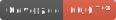

# svstamp



Código fuente de [svtamp.com](https://svstamp.com/), un archivo de tweets de El Salvador marcados utilizando @tweet_stamp [@tweet_stamp](https://tweetstamp.org/). El proyecto utiliza [Next.js](https://nextjs.org/), [TypeScript](https://www.typescriptlang.org/), [MongoDB](https://www.mongodb.com/cloud/atlas) y [Tailwind CSS](https://tailwindcss.com/).

## Cómo contribuir

### Con sugerencias o reportar un problema

Gracias por el interés en ayudar con el proyecto. Para compartir tu sugerencia o reporte puedes crear un [_issue_](https://github.com/ricardoerl/svstamp/issues/new) con la mayor cantidad de información posible para que luego alguien lo pueda pueda revisar. Por favor revisar antes otros [_issues_](https://github.com/ricardoerl/svstamp/issues) para evitar duplicados.

### Con código o documentación

Toda ayuda con código o documentación es bienvenida. Puedes revisar el [_Roadmap_](#Roadmap) actual o cualquiera de los [_issues_](https://github.com/ricardoerl/svstamp/issues) abiertos. Si es una sugerencia nueva o cambio importante, abre primero un [_issue_](https://github.com/ricardoerl/svstamp/issues/new) para discutir el cambio.

#### Instalación

Para clonar y ejecutar el proyecto se necesita Git y Node.js (12+) instalados en tu computadora.

Luego en la carpeta del proyecto:

```bash
# Instalar dependencias
$ npm install

# Ejecutar la aplicación en desarrollo
$ npm run dev

# Ejecutar pruebas unitarias
$ npm run test

# Ejecutar pruebas unitarias con watch mode
$ npm run test:watch

```

Ahora deberías poder ver la aplicación ejecutándose en `http://localhost:3000/`

_Nota:_ Es necesario renombrar el archivo `.env.example` a `.env`. Las credenciales por el momento son de prueba y tiene limitantes, cualquier problema por favor reportarlo.

_Nota:_ Es requerido ejecutar exitosamente todas las pruebas unitarias antes de contribuir con un cambio. Cada cambio debe llevar pruebas unitarias (si aplica).

##### Probar el proyecto en modo producción

```bash
# Construir la aplicación en producción
$ npm run build

# Ejecutar la aplicación en producción en servidor local
$ npm run start
```

## Roadmap

- [x] Mostrar cuadrícula de tweets de la base de datos
- [x] Guardar y validar nuevos tweets
- [x] Agregar página de condiciones y término de uso
- [x] Soporta filtros básicos (autor)
- [x] Optimizar la integración de tailwindcss
- [x] Agregar cómo contribuir
- [ ] Agregar soporte de paginación
- [ ] Agregar soporte swr
- [ ] Agregar soporte de MirageJS
- [x] Agregar soporte de TypeScript
- [x] Agregar cobertura de testing
- [ ] Soporta filtros avanzados (fecha, texto)

## Licencia

MIT License

Copyright (c) 2020 Ricardo Ramírez

Permission is hereby granted, free of charge, to any person obtaining a copy
of this software and associated documentation files (the "Software"), to deal
in the Software without restriction, including without limitation the rights
to use, copy, modify, merge, publish, distribute, sublicense, and/or sell
copies of the Software, and to permit persons to whom the Software is
furnished to do so, subject to the following conditions:

The above copyright notice and this permission notice shall be included in all
copies or substantial portions of the Software.

THE SOFTWARE IS PROVIDED "AS IS", WITHOUT WARRANTY OF ANY KIND, EXPRESS OR
IMPLIED, INCLUDING BUT NOT LIMITED TO THE WARRANTIES OF MERCHANTABILITY,
FITNESS FOR A PARTICULAR PURPOSE AND NONINFRINGEMENT. IN NO EVENT SHALL THE
AUTHORS OR COPYRIGHT HOLDERS BE LIABLE FOR ANY CLAIM, DAMAGES OR OTHER
LIABILITY, WHETHER IN AN ACTION OF CONTRACT, TORT OR OTHERWISE, ARISING FROM,
OUT OF OR IN CONNECTION WITH THE SOFTWARE OR THE USE OR OTHER DEALINGS IN THE
SOFTWARE.
